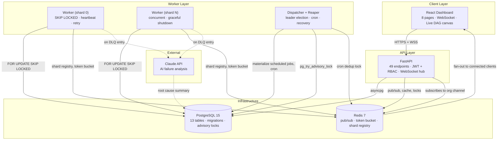

# Architecture

## System overview

The scheduler is split into four independently-deployable process types that
share a single Postgres database and a single Redis instance as their only
coordination points — there is no message broker, no separate queue service,
and no shared in-memory state between processes.

## Why this shape

**No message broker.** Job state and job data live in the same row in the
same database. An external broker (RabbitMQ, SQS) introduces a window where
a message is dequeued but the corresponding database row hasn't caught up —
that window is where duplicate-processing and phantom-job bugs come from in
practice. Postgres's `SELECT ... FOR UPDATE SKIP LOCKED` gives the same
atomic-claim guarantee a broker would, without a second system to keep in
sync. See [`design-decisions.md`](./design-decisions.md) for the full
trade-off analysis.

**Workers are stateless and horizontally scalable.** Any number of worker
processes can point at the same queue. Each one independently polls,
atomically claims a job, executes it, and heartbeats. There is no
worker-to-worker communication — coordination is entirely mediated through
Postgres row locks and a Redis-backed shard registry (Phase 10). Killing a
worker simply means its claimed jobs sit until the reaper (see below)
reclaims them; no state is lost.

**The dispatcher is a singleton, elected via Postgres advisory lock.** Two
responsibilities need exactly one active owner at a time: materializing due
`scheduled`/`delayed` jobs into `queued`, and firing recurring (`cron`) jobs.
Every dispatcher process tries `pg_try_advisory_lock(123456789)` on startup;
whichever succeeds runs the loops, everyone else polls the lock every 10s as
a warm standby. If the primary's connection drops (crash, restart), Postgres
releases the advisory lock automatically and a standby takes over — no
manual failover step.

**The reaper implements the "visibility timeout" pattern.** Workers send a
heartbeat every 10s. Every 30s, the reaper looks for workers whose
`last_seen` is older than 45s, marks them offline, and resets any job they
had `claimed`/`running` back to `queued`. This is the same pattern SQS and
Celery use — it means a crashed worker's jobs recover automatically, at the
cost of at-least-once delivery (handlers must be idempotent).

**AI analysis is fully decoupled from job execution.** When a job exhausts
its retries and lands in the dead-letter queue, the worker fires
`asyncio.create_task(ai_service.run_dlq_analysis(...))` and moves on
immediately — it is never awaited. A slow or failing Claude API call can
never block the worker's poll loop. If no API key is configured, or the call
fails for any reason, the fallback path returns a fully-structured static
analysis derived from the existing error-classification heuristics, so the
UI never shows a blank state.

## Process inventory

| Process | Entry point | Cardinality | Coordinates via |
|---|---|---|---|
| API server | `uvicorn app.main:app` | N (stateless, behind any LB) | Postgres, Redis pub/sub |
| Worker | `python -m app.worker.entrypoint` | N per queue (sharded) | Postgres `SKIP LOCKED`, Redis shard registry + token bucket |
| Dispatcher + reaper | `python -m app.scheduler.entrypoint` | N (1 active, rest standby) | Postgres advisory lock, Redis cron-dedup lock |

## Real-time updates

FastAPI holds one `ConnectionManager` per process, keyed by `org_id`. A
background task in the app's lifespan subscribes to
`scheduler:events:{org_id}` on Redis; whichever API process a client's
WebSocket happens to be connected to receives every event published to that
org's channel and fans it out to its own connected sockets. Workers and the
dispatcher publish onto that same channel — they never talk to the API
process directly. This means the API layer can scale horizontally without
workers needing to know which API instance a given browser is connected to.
