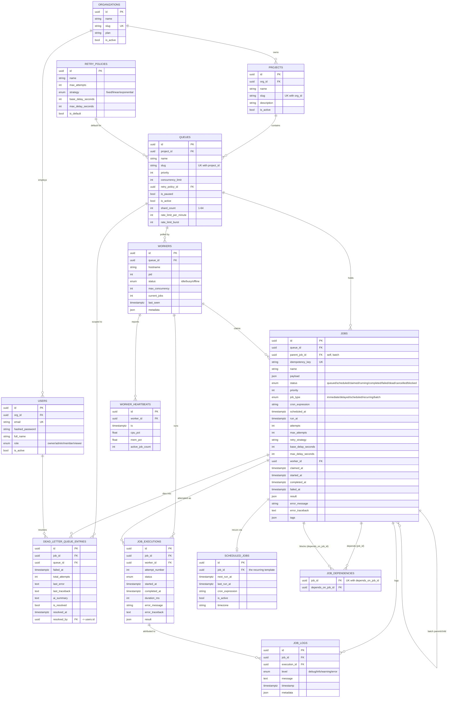

# Entity-Relationship Diagram

All 13 tables, as they exist in the Alembic-managed schema
(`backend/alembic/versions/`). Every table also carries `created_at` /
`updated_at` via a shared `TimestampMixin`, omitted below for readability.



## Indexing notes

The single most important index in the schema is the compound index behind
the atomic claim query:

```sql
CREATE INDEX ix_jobs_claim_query
  ON jobs (queue_id, status, priority DESC, created_at ASC);
```

Every other index exists to support a specific hot-path query rather than
"just in case":

| Index | Serves |
|---|---|
| `ix_jobs_claim_query` (`queue_id, status, priority DESC, created_at`) | The claim query's `WHERE queue_id = ... AND status = 'queued' ORDER BY priority DESC, created_at ASC` |
| `ix_jobs_status` | Dashboard/queue aggregate counts (`COUNT(*) FILTER (WHERE status = ...)`) |
| `ix_jobs_scheduled_at` | Dispatcher's materializer scan (`WHERE status='scheduled' AND scheduled_at <= now()`) |
| `ix_jobs_worker_id` | Reaper's "what did this dead worker have claimed" lookup |
| `ix_worker_heartbeats_ts` | Heartbeat history queries (latest N per worker) |
| `ix_job_executions_job_id_attempt_number` | Execution history ordered by attempt |
| `ix_job_logs_timestamp` | Recent-logs queries (including the AI prompt's log window) |
| `ix_scheduled_jobs_next_run_at` | Cron scheduler's due-template scan |
| `ix_projects_org_id_slug` / `ix_queues_project_id_slug` (unique) | Slug uniqueness scoped to parent, not global |
